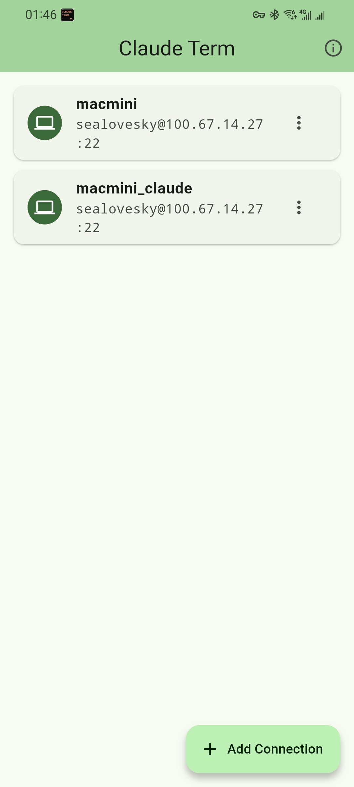
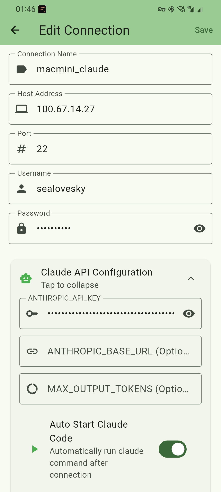
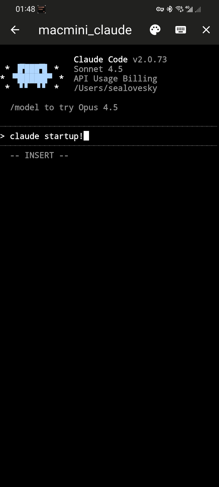

# Claude Term

A mobile terminal app for remotely connecting to Claude Code.

[English](#english) | [中文](#中文) | [日本語](#日本語)

---

## English

### Introduction

Claude Term is a professional SSH terminal application designed specifically for developers who want to use Claude Code remotely. Connect to your remote server from your phone or tablet, and enjoy the full Claude Code experience anywhere.

### Features

#### SSH Connection Management
- Save and manage multiple SSH connections
- Password and private key authentication
- Connection history tracking
- Quick connect to saved hosts

#### Full Terminal Emulation
- Complete SSH terminal with xterm support
- Real-time output display
- Special key support (Ctrl+C, Ctrl+D, Tab, Arrow keys)
- Scrollback history (up to 10,000 lines)

#### Claude Code Integration
- Automatic Claude API environment variable export
- ANTHROPIC_API_KEY configuration
- Custom ANTHROPIC_BASE_URL support (proxy/custom endpoints)
- MAX_OUTPUT_TOKENS setting
- Auto-start Claude Code on connection

#### Quick Command Bar
- Claude Code commands: `/help`, `/compact`, `/cost`, `/clear`, `/config`
- Common terminal commands: `ls`, `pwd`, `clear`, `git status`
- Special keys: Enter, Tab, Ctrl+C, Ctrl+D, Arrow keys

#### Terminal Themes
5 built-in themes:
- Default (black background, white text)
- Homebrew (classic green terminal)
- Pro (macOS Pro style)
- Ocean (blue ocean style)
- Dracula (popular dark theme)

#### Internationalization
- English
- Simplified Chinese (简体中文)
- Japanese (日本語)

#### Background Service
- Foreground service to keep SSH connection alive
- Works in background on both iOS and Android

### Screenshots

<p float="left">
  
  
  
  
</p>

### Installation

#### From Source

```bash
# Clone the repository
git clone https://github.com/sealovesky/claude-term.git
cd claude-term

# Install dependencies
flutter pub get

# Run on device
flutter run

# Build release APK
flutter build apk --release

# Build iOS
flutter build ios --release
```

#### Requirements
- Flutter SDK ^3.0.0
- iOS 12.0+ / Android 5.0+

### Usage

1. **Add Connection**: Tap the + button to add a new SSH connection
2. **Configure**: Enter host, port, username, and password
3. **Claude API** (Optional): Expand "Claude API Configuration" to set your API key
4. **Connect**: Tap the connection to start terminal session
5. **Use Quick Commands**: Toggle the command bar for quick access to common commands

### Tech Stack

- **Framework**: Flutter
- **SSH Client**: dartssh2
- **Terminal**: xterm
- **State Management**: Provider
- **Storage**: SharedPreferences

### License

MIT License

---

## 中文

### 简介

Claude Term 是一款专为开发者设计的SSH终端应用，让你可以在手机或平板上远程连接 Claude Code。随时随地享受完整的 Claude Code 编程体验。

### 功能特性

#### SSH 连接管理
- 保存和管理多个SSH连接
- 支持密码和私钥认证
- 连接历史记录
- 快速连接已保存的主机

#### 完整终端模拟
- 完整的SSH终端（xterm支持）
- 实时输出显示
- 特殊按键支持（Ctrl+C、Ctrl+D、Tab、方向键）
- 滚动历史（最多10,000行）

#### Claude Code 集成
- 自动导出 Claude API 环境变量
- ANTHROPIC_API_KEY 配置
- 自定义 ANTHROPIC_BASE_URL（代理/自定义端点）
- MAX_OUTPUT_TOKENS 设置
- 连接后自动启动 Claude Code

#### 快捷命令栏
- Claude Code 命令：`/help`、`/compact`、`/cost`、`/clear`、`/config`
- 常用终端命令：`ls`、`pwd`、`clear`、`git status`
- 特殊按键：Enter、Tab、Ctrl+C、Ctrl+D、方向键

#### 终端主题
5种内置主题：
- Default（黑底白字）
- Homebrew（经典绿色终端）
- Pro（macOS Pro风格）
- Ocean（蓝色海洋风格）
- Dracula（流行暗色主题）

#### 国际化
- English（英文）
- 简体中文
- 日本語（日文）

#### 后台服务
- 前台服务保持SSH连接活跃
- iOS 和 Android 后台运行支持

### 截图

<p float="left">
  
  
  
  
</p>

### 安装

#### 从源码构建

```bash
# 克隆仓库
git clone https://github.com/sealovesky/claude-term.git
cd claude-term

# 安装依赖
flutter pub get

# 运行
flutter run

# 构建 Release APK
flutter build apk --release

# 构建 iOS
flutter build ios --release
```

#### 环境要求
- Flutter SDK ^3.0.0
- iOS 12.0+ / Android 5.0+

### 使用方法

1. **添加连接**：点击 + 按钮添加新的SSH连接
2. **配置信息**：输入主机、端口、用户名和密码
3. **Claude API**（可选）：展开"Claude API配置"设置API密钥
4. **连接**：点击连接进入终端
5. **快捷命令**：切换命令栏快速访问常用命令

### 技术栈

- **框架**: Flutter
- **SSH客户端**: dartssh2
- **终端**: xterm
- **状态管理**: Provider
- **存储**: SharedPreferences

### 许可证

MIT License

---

## 日本語

### 概要

Claude Term は、Claude Code をリモートで使用したい開発者向けに設計されたプロフェッショナルなSSHターミナルアプリです。スマートフォンやタブレットからリモートサーバーに接続し、どこでも完全な Claude Code 体験をお楽しみください。

### 機能

#### SSH接続管理
- 複数のSSH接続を保存・管理
- パスワードと秘密鍵認証をサポート
- 接続履歴の追跡
- 保存したホストへのクイック接続

#### フルターミナルエミュレーション
- xterm対応の完全なSSHターミナル
- リアルタイム出力表示
- 特殊キーサポート（Ctrl+C、Ctrl+D、Tab、矢印キー）
- スクロールバック履歴（最大10,000行）

#### Claude Code 統合
- Claude API環境変数の自動エクスポート
- ANTHROPIC_API_KEY設定
- カスタムANTHROPIC_BASE_URLサポート
- MAX_OUTPUT_TOKENS設定
- 接続時にClaude Codeを自動起動

#### クイックコマンドバー
- Claude Codeコマンド：`/help`、`/compact`、`/cost`、`/clear`、`/config`
- 一般的なターミナルコマンド：`ls`、`pwd`、`clear`、`git status`
- 特殊キー：Enter、Tab、Ctrl+C、Ctrl+D、矢印キー

#### ターミナルテーマ
5つの組み込みテーマ：
- Default（黒背景、白文字）
- Homebrew（クラシックな緑のターミナル）
- Pro（macOS Proスタイル）
- Ocean（ブルーオーシャンスタイル）
- Dracula（人気のダークテーマ）

#### 国際化
- English（英語）
- 简体中文（簡体字中国語）
- 日本語

#### バックグラウンドサービス
- SSH接続を維持するためのフォアグラウンドサービス
- iOSとAndroidの両方でバックグラウンド動作

### スクリーンショット

<p float="left">
  
  
  
  
</p>

### インストール

#### ソースからビルド

```bash
# リポジトリをクローン
git clone https://github.com/sealovesky/claude-term.git
cd claude-term

# 依存関係をインストール
flutter pub get

# 実行
flutter run

# リリースAPKをビルド
flutter build apk --release

# iOSをビルド
flutter build ios --release
```

#### 必要条件
- Flutter SDK ^3.0.0
- iOS 12.0+ / Android 5.0+

### 使い方

1. **接続を追加**：+ボタンをタップして新しいSSH接続を追加
2. **設定**：ホスト、ポート、ユーザー名、パスワードを入力
3. **Claude API**（オプション）：「Claude API設定」を展開してAPIキーを設定
4. **接続**：接続をタップしてターミナルセッションを開始
5. **クイックコマンド**：コマンドバーを切り替えて一般的なコマンドにすばやくアクセス

### 技術スタック

- **フレームワーク**: Flutter
- **SSHクライアント**: dartssh2
- **ターミナル**: xterm
- **状態管理**: Provider
- **ストレージ**: SharedPreferences

### ライセンス

MIT License

---

## Contributing

Contributions are welcome! Please feel free to submit a Pull Request.

## Acknowledgments

- [dartssh2](https://pub.dev/packages/dartssh2) - SSH client library
- [xterm](https://pub.dev/packages/xterm) - Terminal emulator
- [Claude Code](https://claude.ai) - AI coding assistant by Anthropic
